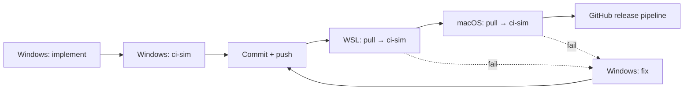

# Playbook: Cross-Platform Smoke Validation

> Recipe for running `tools.cs ci-sim` on the three host families (Windows, WSL/Linux, macOS) after a build-host change. Companion to [`local-development.md`](local-development.md) (managed dev surface) and [`local-validation.md`](local-validation.md) (`tools.cs` reference).

## Why

Build-host changes that touch the manifest schema, DI composition, harvest/pack/smoke flows, or runtime profiles can pass on one platform and break on another. The 7-RID matrix exercises platform-specific paths (vcpkg triplet build, ldd vs dumpbin vs otool dependency walking, tar vs DLL deployment, Mono on macOS for net462 smoke), so a Windows-only validation isn't sufficient for those changes.

Pure managed-only changes (pure C# refactors that don't touch the build host) only need Windows host validation.

## When to run cross-platform

Run on Windows + WSL + macOS when the change touches:

- `manifest.json` schema
- Cake `BuildContext` / DI composition
- Harvest, ConsolidateHarvest, Package, NativeSmoke, PackageConsumerSmoke pipelines
- `IRuntimeProfile`, `IPathService`, or any platform-conditional code
- vcpkg overlay triplets

Windows-only is fine for:

- Pure managed binding code (`src/SDL2.*`)
- Pure docs / playbooks
- Test infrastructure that doesn't ride the native flow

## Hosts

| Host | Access | Repo path |
| --- | --- | --- |
| Windows | local | `E:\repos\my-projects\janset2d\sdl2-cs-bindings` |
| WSL (Ubuntu) | local WSL | `/home/deniz/repos/sdl2-cs-bindings` |
| macOS | `ssh Armut@192.168.50.178` | `/Users/armut/repos/sdl2-cs-bindings` |

> **Critical rule for WSL.** **Never run `dotnet`, `tools.cs`, or vcpkg operations on top of the Windows path** (`/mnt/e/repos/...`). WSL must operate on its own ext4 path (`/home/deniz/repos/sdl2-cs-bindings`). Cross-FS execution mixes file permissions and triggers spurious vcpkg / submodule churn.

## Workflow



Source of truth is **Windows**. WSL and macOS are validation hosts that follow master. Local changes on the WSL/macOS hosts are disposable.

### Step 1 — Windows ci-sim (pre-commit)

```pwsh
dotnet run --file tools.cs -- ci-sim
```

All 8 stages must PASS in the Spectre summary (CleanArtifacts is `tools.cs`-internal, not a Cake stage). If any stage fails, fix locally and re-run before committing.

### Step 2 — Commit + push

After Windows ci-sim is green, present the commit summary, get approval (per AGENTS.md), then commit + push.

### Step 3 — WSL ci-sim

Both WSL and macOS use **zsh** as the login shell. The `DOTNET_ROOT`/`PATH` exports live in `.zshrc` / `.zprofile`, not `.bashrc`. Drive non-interactively with `zsh -lc` so the login shell loads them.

```zsh
# Inside an interactive WSL shell
cd /home/deniz/repos/sdl2-cs-bindings
git fetch origin
git reset --hard origin/master    # local changes are disposable
git submodule update --init --recursive
dotnet run --file tools.cs -- ci-sim
```

```pwsh
# Driving WSL non-interactively from Windows (note: zsh, not bash)
wsl -- zsh -lc 'cd /home/deniz/repos/sdl2-cs-bindings && dotnet run --file tools.cs -- ci-sim'
```

The hard reset is intentional: WSL is a validation host, not a development host. Anything sitting in WSL's working tree before the pull is from a previous validation run and can be discarded.

### Step 4 — macOS ci-sim

```zsh
# From Windows (interactive)
ssh Armut@192.168.50.178

# Then on macOS (default shell is zsh)
cd /Users/armut/repos/sdl2-cs-bindings
git fetch origin
git reset --hard origin/master
git submodule update --init --recursive
./tools.cs ci-sim                 # or: dotnet run --file tools.cs -- ci-sim
```

```pwsh
# Driving macOS non-interactively from Windows (zsh login shell)
ssh Armut@192.168.50.178 'zsh -lc "cd /Users/armut/repos/sdl2-cs-bindings && git fetch origin && git reset --hard origin/master && git submodule update --init --recursive && dotnet run --file tools.cs -- ci-sim"'
```

Host RID will be `osx-x64` (Intel) or `osx-arm64` (Apple Silicon) depending on the box hardware.

### Step 5 — GitHub release pipeline

After both WSL and macOS ci-sim pass, the final gate is the actual `release.yml` pipeline run on GitHub Actions (full 7-RID matrix). Trigger via `workflow_dispatch`.

## Failure triage

When WSL or macOS ci-sim fails:

1. **Capture the failing log** under `.logs/tools/<platform>-ci-sim-<runId>/<NN>-<TargetName>.log` on the validation host.
2. **Diagnose vs. Windows-side ci-sim that passed.** Likely failure modes:
   - **Linux/macOS-specific path or shell behavior** (e.g. tar vs DLL, ldd vs otool, glibc symbol versions)
   - **`IPathService` casing** (Windows is case-insensitive; Linux is not — manifest references must match disk exactly)
   - **`IRuntimeProfile` system-exclusion list mismatch** (per-platform `manifest.system_exclusions`)
   - **Mono availability** for macOS net462 smoke (skipped if `mono` is not on `$PATH`)
3. **Fix on Windows.** Don't fix forward on the validation host — it's disposable. Edit on Windows, commit, push, re-pull on the validation host.
4. **Fix-forward via separate commits.** No `git commit --amend` on a pushed commit. Each fix-forward goes through the same approval gate.

## Cross-Reference

- [`local-development.md`](local-development.md) — fresh-clone setup, managed-only build, system-wide SDL2 install
- [`local-validation.md`](local-validation.md) — `tools.cs` reference (ci-sim, setup, build passthrough)
- [`overlay-management.md`](overlay-management.md) — vcpkg overlay triplets
- [`../knowledge-base/release-guardrails.md`](../knowledge-base/release-guardrails.md) — what each pipeline stage validates
- [`../../AGENTS.md`](../../AGENTS.md) — approval gate, settled strategic decisions
