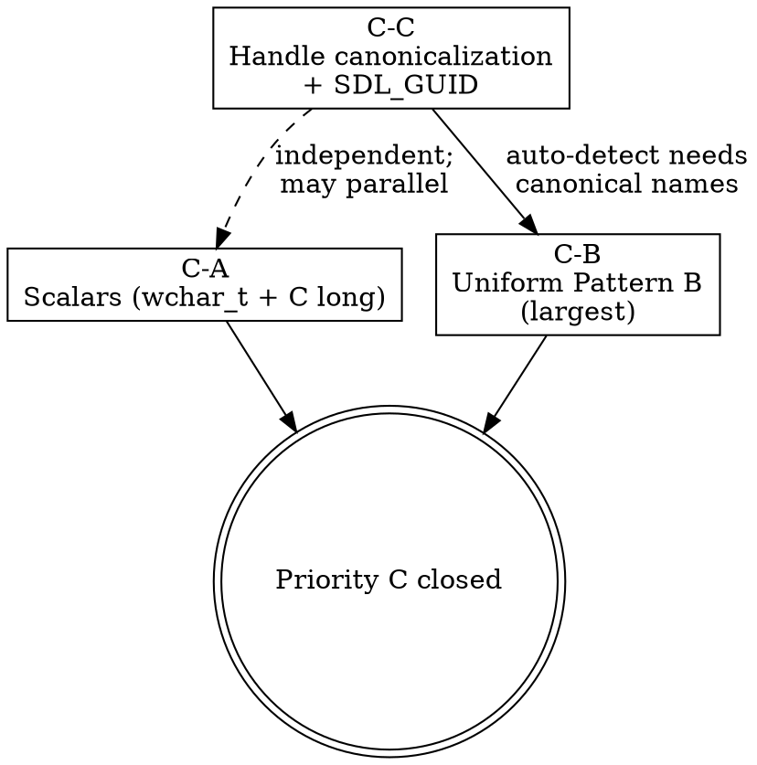

# Priority C — Semantic ABI Completion for ClangSharp Spike Layer 1

**Date:** 2026-05-24
**Status:** Design approved 2026-05-24; awaiting implementation plan (`writing-plans` transition).
**Scope:** Close the six known semantic-ABI risks identified by oracle evidence so the active ClangSharp + Roslyn postprocess spike under [`spikes/binding-generators/`](../../../spikes/binding-generators/) reaches **ABI-compatible Layer 1** status, unblocking the Layer 2 typed public API slice that follows.

> **Toolchain context:** ADR-004 (binding-autogen toolchain) is Reopened (2026-05-23) and the toolchain selection is under spike re-evaluation. The work in this design lives on the ClangSharp + Roslyn postprocess prototype because that is the active comparison prototype. A subsequent comparable Alimer-style single-pass CppAst evidence pass is the next gate before the toolchain ADR amendment. Policy decisions in this design (typed handle by value at raw, C `long` hybrid, `wchar_t*` opaque, per-header RSP organization) are **toolchain-neutral** and bind whichever generator implementation ships.

## Reading Order

| # | Doc | Purpose |
| --- | --- | --- |
| 1 | This file | Priority C implementation design |
| 2 | [`docs/binding-autogen/binding-generator-constitution.md`](../../binding-autogen/binding-generator-constitution.md) | Canonical ABI/API policy (L33-58, L189-260, L262-308, L383-394 most relevant) |
| 3 | [`docs/research/semantic-abi-type-classification-research.md`](../../research/semantic-abi-type-classification-research.md) | Research backing for Priority C decisions (2026-05-22) |
| 4 | [`spikes/binding-generators/output/reports/oracle-evidence-clangsharp.md`](../../../spikes/binding-generators/output/reports/oracle-evidence-clangsharp.md) | Evidence for the six risks |
| 5 | [`spikes/binding-generators/docs/llm-handoff.md`](../../../spikes/binding-generators/docs/llm-handoff.md) | Spike-internal context |

## Context

The ClangSharp + Roslyn postprocess spike reached "near-ABI-compatible Layer 1" after slices A (raw-container visibility, commit `92b893b`) and B (SDL.h required surface, commit `444fada`). The Roslyn-based `oracle.cs` evidence reporter then surfaced six remaining semantic-ABI risks under "Priority C" (oracle category: deferred layouts + platform-sensitive scalar mappings).

**Six known risks (oracle evidence file:line citations):**

| # | Risk | Evidence | Constitution authority | Wrong on |
| --- | --- | --- | --- | --- |
| R1 | shared `wchar_t*` → `ushort*` | `SDL_hidapi.g.cs:21,27,31,77,114,118,122,126` + `SDL_stdinc.g.cs:147,151,155,158,162,166,169,172,175` + `Platforms/WinRT/SDL_system.g.cs:34` (15 symbols, 30 findings) | L246-260 | Linux/macOS — buffer corruption |
| R2 | C `long` / `unsigned long` → `int`/`uint` | `SDL_stdinc.g.cs:247,251,268,272,404,408` + `SDL_thread.g.cs:38,42` (8 symbols, 12 findings) | L203-220, L223-228 | Linux/macOS — truncated return |
| R3 | `SDL_RWops` full layout including platform-conditioned `_hidden_e__Union` | `SDL_rwops.g.cs:6-77` | L293-298 | non-Windows — wrong layout, satellite-spreading |
| R4 | `SDL_SysWMinfo` Windows-shaped partial layout | `SDL_syswm.g.cs:60+` | L300-302 | non-Windows — false ABI |
| R5 | `SDL_SysWMmsg` Windows-shaped partial layout | `SDL_syswm.g.cs:25-58` | L300-302 | non-Windows — false ABI |
| R6 | Opaque-handle tag leak (`SDL_hid_device_` instead of canonical `SDL_hid_device`; `SDL_semaphore` instead of `SDL_sem`) | `SDL_hidapi.g.cs:6` + `SDL_mutex.g.cs:9` | L262-277 | all RIDs — API-shape noise, not ABI failure |

Beyond the six oracle items, this design also closes **SDL_GUID type substitution** (Workstream README Decision Posture pins `SDL_GUID → System.Guid`, but the ClangSharp spike does not yet apply it).

## Goals

1. **Zero Priority C oracle findings** after implementation: no `platform-sensitive-wchar`, no `platform-sensitive-long`, no `deferred-layout-*` finding lines in `oracle.cs --write-report`.
2. **Multi-TFM compile clean** across `net10.0`/`net9.0`/`net8.0`/`netstandard2.0`/`net462` for both `Janset.SDL2.Core` and `Janset.SDL2.Image` after the implementation.
3. **Constitution Layer 1 contract satisfied** (L37, L388, L390-391): no public raw extern leak; high-risk type translations have fixture coverage; platform-conditioned struct layouts are opaque.
4. **Spike output ready for Layer 2 design.** Typed handle structs in place for every opaque handle, so the next slice only adds public methods on `SDL2.SDL` calling the internal raw `SDLNative` — no extra raw-side type work.
5. **Research findings preserved as canonical policy.** Constitution gains WHY/HOW/WHAT subsections for each Priority C policy decision; cross-references to this design and the research evidence remain durable beyond the spike.

## Non-Goals

- **Not Layer 2.** Public typed low-level methods on `SDL2.SDL`/`SDL_image` are deferred to the Layer 2 slice that follows. Typed handle structs emitted in this design are part of Layer 1's raw-ABI surface, not the public method projection.
- **Not Layer 3.** Friendly overloads (`string`/`Span<T>`/`out T`) for `wchar_t`/`SDL_RWops`/etc. are deferred to the Layer 3 friendly overload slice.
- **Not toolchain selection.** Alimer-style CppAst comparison evidence is a separate slice; this design does not pre-empt the ADR-004 amendment.
- **Not Cake-impl migration.** The sunset Cake-hosted `build/_build/Targets/GenerateBindings/` implementation is not touched here. Policy updates land in the Constitution; mechanism changes land in the active spike.
- **Not dynapi reporting cleanup** (Finding 5 of the research doc). Non-blocker; deferred to a separate `oracle.cs` polish slice.
- **Not the `implicit operator nint` final API review.** Research Finding 3 raises it as a pre-public-API-snapshot decision. This design uses **explicit-only** operator (matching the research recommendation); the formal API snapshot review happens later before the first preview.

---

## Policy Decisions

Each subsection uses **WHY / HOW / WHAT** per Constitution L41-47 precedent. These are the durable policy decisions; Constitution updates (Task #21) carry the same text and reference back to this design.

### Decision 1 — Typed Handle Struct By Value at Raw ABI

**WHY.** A `readonly partial struct X(nint value)` with a single pointer-sized field is **ABI-equivalent** to passing a bare `IntPtr` or `void*` at the P/Invoke boundary. Microsoft's [native interop best-practices](https://learn.microsoft.com/en-us/dotnet/standard/native-interop/best-practices) classifies it as blittable; the SysV x64, AAPCS64, MSVC ARM64, and x86 ABIs all classify a single-integer-field composite type identically to that integer (passed in the same GPR or stack slot). A research probe confirmed bit-identical wire shape across all 7 target RIDs. The "use IntPtr only at the P/Invoke boundary" guidance in older .NET interop literature predates modern language features (`readonly struct`, `nint`, primary constructors, `LibraryImport` source-generated marshalling) and never reflected an ABI constraint — only a marshaller-maturity concern that has been resolved for over a decade. Cake's `RawAbiCommandEmitter`, Alimer.Bindings.SDL, TerraFX.Interop.Windows, and Silk.NET (with a non-readonly variant) all emit P/Invoke signatures using typed-handle-by-value.

**HOW.** Every opaque SDL handle emits as:

```csharp
[StructLayout(LayoutKind.Sequential)]
public readonly partial struct SDL_Window : IEquatable<SDL_Window>
{
    public SDL_Window(nint value) { Value = value; }
    public nint Value { get; }

    public bool IsNull => Value == 0;
    public bool IsNotNull => Value != 0;
    public static SDL_Window Null => default;

    public nint DangerousGetHandle() => Value;

    public bool Equals(SDL_Window other) => Value == other.Value;
    public override bool Equals(object? obj) => obj is SDL_Window other && Equals(other);
    public override int GetHashCode() => Value.GetHashCode();
    public static bool operator ==(SDL_Window left, SDL_Window right) => left.Equals(right);
    public static bool operator !=(SDL_Window left, SDL_Window right) => !left.Equals(right);

    public static explicit operator nint(SDL_Window value) => value.Value;
    public static explicit operator SDL_Window(nint value) => new(value);
}
```

Notes on the shape:
- `[StructLayout(LayoutKind.Sequential)]` is explicit (no reliance on language defaults).
- Explicit (not implicit) `operator nint` per research Finding 3 — implicit conversion weakens the type safety the struct provides; `DangerousGetHandle()` is the documented escape hatch.
- `Value` is a get-only property, not a public field — public fields are evolution-unfriendly per .NET design guidelines.
- Primary constructor avoided; explicit constructor is more defensive across `LangVersion` settings.

Raw ABI signatures reference the typed handle **by value**:

```csharp
[LibraryImport("SDL2")]
public static partial SDL_Window SDL_CreateWindow(byte* title, int x, int y, int w, int h, uint flags);

[LibraryImport("SDL2")]
public static partial void SDL_DestroyWindow(SDL_Window window);
```

Old style (`SDL_Window*` pointer references) is rewritten to by-value at every single-pointer occurrence. Double-pointer (`SDL_Window**`) and `out` parameter positions are preserved.

Postprocess realization: the `OpaqueHandleEmitRewriter` ([`spikes/binding-generators/clangsharp/postprocess/OpaqueHandleEmitRewriter.cs`](../../../spikes/binding-generators/clangsharp/postprocess/OpaqueHandleEmitRewriter.cs)) implements this HOW. Its `DiscoverAutoDetectedHandles(inputDir)` static helper drives the auto-detect channel via a **syntactic** criterion: the intersection of empty `public partial struct SDL_X { }` declarations and `SDL_X*` pointer-use sites in raw ABI parameter/return positions, computed over the post-ClangSharp output for one TFM view. The earlier `[NativeTypeName("X *")]` cross-reference is dropped — ClangSharp omits that annotation when the C tag/typedef name matches the emitted C# name (the common case for opaque handles), so the annotation-driven heuristic under-detected. Wired into `postprocess/Program.cs` as the `uniform-opaque` mode.

The canonical roster of opaque handles lives at [`spikes/binding-generators/clangsharp/policy/opaque-handle-roster.json`](../../../spikes/binding-generators/clangsharp/policy/opaque-handle-roster.json) — version-keyed against SDL2 (currently `2.32.10`), triangulated against SDL2 headers + wiki.libsdl.org + ClangSharp Modern empty-struct emit. The rewriter's syntactic auto-detect output is cross-checked against the roster's `auto_detect_well_known` field; drift surfaces as a build-time warning (not failure) so upstream SDL2 additions become visible without forcing immediate Constitution patches. The force-opaque allow-list is loaded from the roster's `force_opaque_exceptions` field instead of being hard-coded in the rewriter source — single-source machine-readability — with Constitution §"Opaque Handles" prose explaining the policy intent (why each force-opaque type cannot expose its full header body).

**WHAT.** All opaque handles in the Layer 1 raw ABI surface emit as typed handle structs. Affected sets:

- **Auto-detected from existing empty structs** (14 names — canonical roster at `spikes/binding-generators/clangsharp/policy/opaque-handle-roster.json`, three-source triangulated against SDL2 2.32.10): `SDL_Window`, `SDL_Renderer`, `SDL_Texture`, `SDL_AudioStream`, `SDL_GameController`, `SDL_Joystick`, `SDL_Haptic`, `SDL_Sensor`, `SDL_Cursor`, `SDL_Thread`, `SDL_mutex`, `SDL_sem` (canonical, after R6), `SDL_cond`, `SDL_hid_device` (canonical, after R6). Detection rule: `public partial struct X { }` with empty body AND `SDL_X*` pointer usage in at least one raw ABI parameter/return position (purely syntactic — no dependency on `[NativeTypeName]` annotations, which ClangSharp omits when C and C# names match).
- **Force-opaque allow-list** (3 names — Constitution-bound): `SDL_RWops`, `SDL_SysWMinfo`, `SDL_SysWMmsg`. These have body in headers but Constitution L293-302 requires Stage 1 quarantine. The rewriter clears the body and emits the typed handle shape.

Constitution L262-277 already requires "public readonly value types wrapping `nint`"; this design specifies the exact shape and applies it uniformly in Layer 1.

---

### Decision 2 — C `long` Hybrid Strategy

**WHY.** C `long` is platform-sensitive (32-bit on Windows LLP64; 64-bit on Linux/macOS LP64). `System.Runtime.InteropServices.CLong` / `CULong` solve this correctly but only exist on .NET 6+. Two distinct categories of SDL2 `long`-using symbols exist:

1. **Convenience helpers** (`SDL_lround`, `SDL_lroundf`, `SDL_ltoa`, `SDL_ultoa`, `SDL_strtol`, `SDL_strtoul` — all in `SDL_stdinc.h`). SDL provides these for platforms with incomplete libc; .NET callers have BCL equivalents (`Math.Round`, `long.Parse`, `ToString()`). SDL2-CS dropped all of them and has shipped successfully for over a decade. The SDL wiki does not document them as user-facing API.
2. **Structural symbols** (`SDL_threadID` typedef + `SDL_ThreadID`/`SDL_GetThreadID` functions). These identify OS threads; `System.Threading.Thread.ManagedThreadId` is **not** equivalent (different ID space). These cannot be dropped without losing thread-identification capability on legacy TFMs.

Microsoft's official guidance for C `long` on `netstandard2.0`/`net462` ([cross-platform data types](https://learn.microsoft.com/en-us/dotnet/standard/native-interop/best-practices)) recommends **dual-DllImport with `RuntimeInformation.IsOSPlatform` dispatch** when the symbol must remain accessible. Cake's `ModernCIntegerEmissionPolicy` + `RawAbiCommandEmitter:49-76` `#if NET6_0_OR_GREATER`-guards entire member emit on legacy TFMs (drop strategy). The hybrid combines both: drop where BCL equivalents exist, dual-dispatch where the symbol is structural.

**HOW.**

The convenience-helper drops below follow Constitution §"BCL-Replaceable Helper Exclusion Policy" — the explicit policy section that codifies the three-condition rule (BCL equivalent exists, SDL2-CS skips, no transitive SDL dependency) and lists these standing exclusions alongside the SDL_iconv_* family.

For the convenience helpers — RSP-level exclusion in a per-header RSP file:

```text
# rsp/per-header/SDL_stdinc.rsp
--exclude
SDL_lround
SDL_lroundf
SDL_ltoa
SDL_ultoa
SDL_strtol
SDL_strtoul
```

For the structural symbols — postprocess rewriter `ThreadIdDualDispatchRewriter` walks `[NativeTypeName("SDL_threadID")]` / `[NativeTypeName("unsigned long")]` annotations on SDL thread-API return positions and emits mode-aware output. TFM gating happens via the project's csproj `<Compile Include>` conditional (`Generated/Compat/**/*.cs` → `netstandard2.0` + `net462`; `Generated/Modern/**/*.cs` → `net6+`); the rewriter emits a single branch per output, so no `#if NET6_0_OR_GREATER` directives are needed. The mode is detected from the input directory's `Compat` / `Modern` path segment, mirroring `PlatformDeltaPostProcessor`. This is the same Compat-vs-Modern split the existing `libraryimport` postprocess uses (Compat keeps `[DllImport]`; Modern is rewritten to `[LibraryImport]`).

Modern emit (single form, requires net6+):

```csharp
[LibraryImport("SDL2", EntryPoint = "SDL_ThreadID")]
[UnmanagedCallConv(CallConvs = new[] { typeof(CallConvCdecl) })]
[return: NativeTypeName("SDL_threadID")]
public static partial CULong SDL_ThreadID();
```

Compat emit (single form, `netstandard2.0` / `net462`): managed wrapper + `RuntimeInformation.IsOSPlatform` dispatching between two private DllImports — `uint` return on Windows LLP64 (C `unsigned long` = 32-bit) and `nint` return on Unix LP64 (C `unsigned long` = 64-bit):

```csharp
[return: NativeTypeName("SDL_threadID")]
public static ulong SDL_ThreadID()
{
    if (RuntimeInformation.IsOSPlatform(OSPlatform.Windows))
        return SDL_ThreadID_Win32();
    return (ulong)SDL_ThreadID_Unix64();
}

[DllImport("SDL2", EntryPoint = "SDL_ThreadID", CallingConvention = CallingConvention.Cdecl, ExactSpelling = true)]
private static extern uint SDL_ThreadID_Win32();

[DllImport("SDL2", EntryPoint = "SDL_ThreadID", CallingConvention = CallingConvention.Cdecl, ExactSpelling = true)]
private static extern nint SDL_ThreadID_Unix64();
```

Caller-side surface diverges by TFM at the Layer 1 raw ABI by design — Modern callers see `CULong` directly (Layer 2 typed wrappers normalize to `ulong`); legacy callers see `ulong` from the managed wrapper. Constitution L220 evidence requirement ("any downlevel strategy must prove exact per-platform ABI shape") is satisfied by a per-RID runtime ABI smoke test (Slice C-A exit gate).

**WHAT.** SDL_stdinc helpers gone from every TFM. Thread-API symbols available on every TFM via TFM-conditional emit. Constitution L223-228's "high-risk SDL2.Core symbols" list updates to reflect the drop (`SDL_lround`/`SDL_lroundf`/`SDL_ltoa`/`SDL_ultoa`/`SDL_strtol`/`SDL_strtoul` → "deferred — BCL equivalent; use `Math.Round`/`long.Parse`/`ToString()`"; `SDL_threadID`/`SDL_ThreadID`/`SDL_GetThreadID` → "kept on all TFMs via hybrid CLong + dual-dispatch").

---

### Decision 3 — Shared `wchar_t*` Opaque Mapping at Raw ABI

**WHY.** C `wchar_t` is implementation-defined (16-bit UTF-16 on Windows; 32-bit UTF-32 on Linux/macOS). C# `char`/`ushort` is always 16-bit. No portable C# primitive maps correctly across the 7 target RIDs. Microsoft's BCL has no portable `wchar_t` story: `[MarshalAs(UnmanagedType.LPWStr)]` and `CharSet.Unicode` are hardcoded 16-bit on every platform (per [interop charset docs](https://learn.microsoft.com/en-us/dotnet/standard/native-interop/charset)), which is wrong for POSIX 32-bit `wchar_t`. A research probe surveyed peer libraries: Silk.NET's `wchar_t → char` (16-bit) is silently wrong on POSIX (anti-pattern); SDL2-CS dropped the entire `SDL_hid_*` API rather than bind it incorrectly; ppy SDL3-CS uses `wchar_t * → IntPtr` raw (opaque). The opaque-pointer pattern is the only ABI-honest mapping for shared `wchar_t*` at the raw layer.

This is **not** a Layer 3 friendly-wrapper repair of a "broken ABI" — opaque `nint` IS the ABI-correct shape because no honest non-opaque shape exists across the target platforms.

**HOW.** RSP-level remap in `base.rsp` (cross-cutting, both space-containing variants for libclang spelling byte-exact match — research probe identified the original `wchar_t*=nint` entry was a dead-letter because libclang renders the field type as `wchar_t *` with a space):

```text
--remap
wchar_t *=nint
const wchar_t *=nint
```

Old `wchar_t*=nint` (no-space, dead entry) is removed. The entries are **unquoted**: ClangSharp's RSP parser (System.CommandLine) treats each non-empty line as one argv element verbatim, so surrounding quotes get included literally in the key and break the byte-exact match (verified at implementation time, 2026-05-24, against ClangSharp 17.0.1 / libclang 17.0.4). ppy SDL3-CS's argv-passing pattern (`--remap "wchar_t *=IntPtr"`) is shell-level quoting that protects the space across argv boundaries, not RSP file syntax.

Windows-only API exception: `SDL_WinRTGetFSPathUNICODE` already emits in `Platforms/WinRT/SDL_system.g.cs` with `[SupportedOSPlatform("windows")]` attribution from earlier slices. The remap applies to it too (it becomes `nint`); platform attribution remains. (Future Layer 3 wrappers for WinRT-only consumers may add a `Marshal.PtrToStringUni`-based decoder; out of Priority C scope.)

Fallback if RSP remap fails (verified at implementation time): postprocess `WcharStarToNintRewriter` walks `[NativeTypeName("wchar_t *")]` / `[NativeTypeName("const wchar_t *")]` annotations and rewrites the managed type to `nint`, with an opt-out allow-list for any deliberately-Windows-only API surface.

**WHAT.** Shared `wchar_t*` raw ABI emit:

| Symbol | Before | After |
| --- | --- | --- |
| `SDL_hid_device_info.serial_number` | `[NativeTypeName("wchar_t *")] public ushort*` | `[NativeTypeName("wchar_t *")] public nint` |
| `SDL_hid_open` `serial_number` param | `[NativeTypeName("const wchar_t *")] ushort*` | `[NativeTypeName("const wchar_t *")] nint` |
| `SDL_hid_get_*_string` `@string` param | `[NativeTypeName("wchar_t *")] ushort*` | `[NativeTypeName("wchar_t *")] nint` |
| `SDL_wcs*` functions (params + returns) | `ushort*` | `nint` |
| `SDL_WinRTGetFSPathUNICODE` return | `[return: NativeTypeName("const wchar_t *")] ushort*` | `[return: NativeTypeName("const wchar_t *")] nint` (Windows-only via existing attribution) |

15 symbols affected.

---

### Decision 4 — Per-Header RSP Organization (ppy Alignment)

**WHY.** The active spike's RSP organization (`base.rsp` + `sdl2-core.rsp` + `sdl2-image.rsp`) puts all family-level concerns into the family RSP. As the spike accumulates per-symbol overrides (R6 tag/typedef remaps, R2 stdinc excludes, future per-header concerns from Layer 2/3 slices), the family RSP grows into a grab-bag with no symbol-locality. ppy SDL3-CS's pattern (one RSP per header, e.g. `SDL_audio.rsp`, `SDL_hidapi.rsp`) keeps per-header concerns close to the header they affect; cross-cutting policy stays in `base.rsp`; family identity stays in the family RSP. The three-tier separation matches the natural "what level of concern is this?" decision tree.

Our multi-TFM context differs from ppy's single-TFM SDL3 setup, but the per-header RSP organization is orthogonal to TFM strategy (dual codegen passes still run at the family level; per-header RSP entries apply to each pass).

**HOW.** Three-tier RSP layout:

```text
spikes/binding-generators/clangsharp/rsp/
├── base.rsp                    (cross-cutting type semantics, defines, --remap, --with-type)
├── sdl2-core.rsp               (family identity: --libraryPath, --methodClassName, family-wide --exclude)
├── sdl2-image.rsp              (family identity for SDL2_image)
└── per-header/
    ├── SDL_stdinc.rsp          (R2 excludes)
    ├── SDL_hidapi.rsp          (R6 tag remap)
    ├── SDL_mutex.rsp           (R6 SDL_semaphore=SDL_sem)
    └── ... (additional per-header files added as needed)
```

Orchestrator change in `generate_bindings.py` (~20-30 lines): for each header invocation, additionally load `rsp/per-header/<header_basename>.rsp` if it exists. RSP precedence: `base.rsp` → family RSP → per-header RSP (last write wins for keyed entries; lists like `--exclude` accumulate).

**WHAT.** Priority C fixes distributed across the three tiers:

- `base.rsp` adds R1 `wchar_t *` remaps (cross-cutting).
- `per-header/SDL_stdinc.rsp` adds R2 stdinc excludes.
- `per-header/SDL_hidapi.rsp` adds R6 `SDL_hid_device_=SDL_hid_device` remap.
- `per-header/SDL_mutex.rsp` adds R6 `SDL_semaphore=SDL_sem` remap.
- Family RSPs unchanged (already encode family identity correctly).

Future Layer 2/3 slices route their per-header concerns into the same `per-header/` tier rather than back into the family RSP.

---

### Decision 5 — Foreign Type Boundary Policy

**WHY.** SDL2 references types owned by external native libraries (Vulkan, Direct3D / DXGI, Microsoft GDK, Linux X11 / Wayland / KMSDRM, macOS Cocoa / UIKit / Metal, WinRT, etc.) at parameter positions in its public API. Users obtain these from dedicated .NET bindings (`Silk.NET.Vulkan`, `Vortice.Windows`, `Silk.NET.OpenGL`, etc.). Wrapping foreign types in our own Pattern B typed handle structs (e.g., emitting `readonly partial struct VkInstance(nint)`) forces every cross-binding call site to construct our wrapper: `new VkInstance(silkInstance.Handle)`. SDL2-CS's 10+ years of shipped precedent uses `IntPtr` / `nint` at foreign parameter positions, which interoperates frictionlessly with any .NET binding that exposes a pointer-sized handle. Distinguishing SDL-owned from foreign types is a manual policy decision — no automatic mechanism exists. The §"Opaque Handles" Pattern B policy binds **SDL-owned** types only; foreign types are not ours to own, rename, or wrap.

The user's real-world interop example (provided 2026-05-24) — SDL2-CS + `Silk.NET.OpenGL` via `GL.GetApi(proc => SDL_GL_GetProcAddress(proc))` — confirms the practical shape: SDL-owned `SDL_GLContext` never crosses into Silk.NET (only re-enters SDL functions), while function-pointer interop happens via delegate factories returning raw pointers. The pattern generalizes: SDL-owned typed handles stay typed; foreign typed handles surface as `nint` for unforced interop.

Peer evidence (2026-05-24 research probes):

- **SDL2-CS:** `IntPtr` everywhere for foreign types (`HWND`, `IDirect3DDevice9`, `VkInstance`, `NSWindow`, `wl_display`, `JNIEnv*`, `XTaskQueueHandle`, `IInspectable`). Comments like `/* IntPtr refers to an HWND */` carry provenance.
- **ppy/SDL3-CS:** keeps raw tag-pointers (`VkInstance_T*`, `XTaskQueueObject**`) with `[NativeTypeName(...)]` annotations. Counter-evidence to auto-canonicalization, but high friction with Silk.NET / Vortice / TerraFX consumers.
- **Silk.NET.Vulkan / Vortice.Vulkan / TerraFX.Interop.Windows:** all expose foreign handles as wrappers around `nint`/`ulong` with `.Handle` accessors returning pointer-sized values — friction with SDL2-CS-style `IntPtr` is zero.
- **Alimer.Bindings.SDL:** flattens Vulkan to raw `nint` / `ulong**` (defers typed Vulkan to external binding).

**HOW.** Foreign types at SDL parameter positions emit as opaque `nint` / `IntPtr`. The `[NativeTypeName(...)]` annotation preserves provenance for documentation and downstream postprocess sensors. Mechanism:

- ClangSharp-style: per-header RSP `--remap` with byte-exact textual match (`--remap "VkInstance *"=nint*`) plus `--exclude` to suppress the parser tag struct emission (`--exclude VkInstance_T`).
- CppAst-style (future): equivalent type-classifier rule plus a foreign-type allow-list (Cake's `ExternalNativeTypePolicy` precedent).

The allow-list is **manually curated** and lives in per-header RSP files close to the SDL header that references the foreign type. Each entry's leading comment cites the SDL header source line of the typedef and the upstream owner library (Vulkan / Win32 / GDK / etc.). No automatic foreign-type detection sweep — additions are deliberate.

**WHAT.** The Priority C survey identifies the foreign-type categories below. Active rows land in this slice; deferred rows are not currently emitted by the spike's multi-OS pass and earn their RSP entries when the corresponding pass is activated.

| Category | Foreign types | Source | Disposition | RSP location |
| --- | --- | --- | --- | --- |
| **Vulkan** | `VkInstance` (= `VkInstance_T *`), `VkSurfaceKHR` (= `VkSurfaceKHR_T *` on 64-bit) | `SDL_vulkan.h:52-53,187-188` | **Active — Task 6** | new `rsp/per-header/SDL_vulkan.rsp` |
| **Direct3D COM** | `IDirect3DDevice9 *`, `ID3D11Device *`, `ID3D12Device *` | `SDL_system.h:77,93,113` (Windows pass) | **Active — Task 6** | new `rsp/per-header/SDL_system.rsp` (Windows-conditioned) |
| **Microsoft GDK** | `XTaskQueueHandle` (= `XTaskQueueObject *`), `XUserHandle` (= `XUser *`) | `SDL_system.h:600-601,616,630` (GDK pass) | **Active — Task 6** | new `rsp/per-header/SDL_system.rsp` (GDK-conditioned) or split GDK file |
| Win32 handles | `HWND` (= `HWND__ *`), `HDC` (= `HDC__ *`), `HINSTANCE` (= `HINSTANCE__ *`) | `SDL_syswm.h:165,235-237` | Already handled | `rsp/sdl2-core.rsp:22-24` |
| Android JNI | `JNIEnv *`, `jobject` | `SDL_system.h:258-294` (SDL pre-erased to `void *`) | Already handled | `rsp/base.rsp:18` `void*=nint` |
| C stdlib | `FILE *`, `va_list`, `_iobuf *`, `_IO_FILE *` | `SDL_rwops.h`, `SDL_log.h`, `SDL_stdinc.h` | Already handled | `rsp/sdl2-core.rsp:18-24,31-38` |
| Metal | `void *` (SDL deliberately exposes `CAMetalLayer *` / `MTLCommandEncoder` as `void *`) | `SDL_render.h:1890-1911`, `SDL_metal.h` | Already handled | `rsp/base.rsp` `void*=nint` |
| Linux X11 | `Display *`, `Window`, `XEvent *` | `SDL_syswm.h:173,249-250` | **Deferred** | `SDL_syswm.h` not in multi-OS pass yet |
| Linux Wayland | `wl_display *`, `wl_surface *`, `wl_egl_window *`, `xdg_*` | `SDL_syswm.h:295-302` | **Deferred** | same |
| Linux KMSDRM | `gbm_device *` | `SDL_syswm.h:342` | **Deferred** | same |
| macOS Cocoa | `NSWindow *` | `SDL_syswm.h:266-271` (Apple pass) | **Deferred** | Apple multi-OS pass not enabled |
| iOS UIKit | `UIWindow *`, `UIViewController *` | `SDL_syswm.h:280-289` (iOS pass) | **Deferred** | same |
| WinRT | `IInspectable *` | `SDL_syswm.h:243` (WinRT pass) | **Deferred** | gated behind excluded `SDL_GetWindowWMInfo` |
| OpenGL / EGL / GLES | Khronos types from `SDL_opengl*.h`, `SDL_egl.h` | not in scope | **Not in scope** | `scope/sdl2-core.headers.txt` excludes the entire header set. `SDL_GLContext` is **SDL-owned** (`typedef void *`), not foreign |
| DirectFB / Mir / Vivante / OS/2 | various | `SDL_syswm.h` | **Excluded** | Constitution L367 Stage 1 exclusion; never emitted |

Constitution L161-164's accepted deferrals (`SDL_RWFromFP`, `SDL_LogMessageV`, `SDL_vsnprintf`, `SDL_vsscanf`, `SDL_vasprintf`) cover the C variadic surface independently of this foreign-type allow-list.

Cross-references:
- Constitution §"Foreign Type Boundary Policy" carries the same allow-list as canonical policy beyond Priority C.
- Research evidence: `docs/research/semantic-abi-type-classification-research.md` Appendix B (2026-05-24 foreign-type surveys).

This decision **revises** the earlier "canonicalize all 10 R6 pairs" stance from the Task 4 oracle discovery: the 6 SDL-owned R6 pairs canonicalize via Slice C-C as planned; the 4 foreign-type pairs (`VkInstance_T`/`VkSurfaceKHR_T`/`XTaskQueueObject`/`XUser`) instead emit as `nint` per this Decision 5 policy. The oracle's `duplicate-tag-typedef` finding for these 4 pairs naturally clears once the tag structs are excluded.

---

## Slices

Each slice is independently testable but the three are sequenced by dependency. See "Sequencing" below.

### Slice C-C — Handle Canonicalization + SDL_GUID

**Scope:** R6 (opaque-handle tag/typedef canonicalization) + `SDL_GUID → System.Guid` substitution. Smallest slice; enables Slice C-B's auto-detect by removing duplicate tag names.

**Mechanism:**

1. **R6 tag/typedef remaps** — per-header RSP entries (Decision 4 mechanism). `SDL_hid_device_=SDL_hid_device` in `per-header/SDL_hidapi.rsp`; `SDL_semaphore=SDL_sem` in `per-header/SDL_mutex.rsp`. ppy's verified pattern: a single `--remap` line renames both the struct declaration and every reference at every site.

2. **Audit for additional tag/typedef pairs** — extend `oracle.cs` with a "duplicate type detected" lane that scans generated output for pairs where a `[NativeTypeName("X *")]` annotation references a type whose declared name differs (`X_` ↔ `X`, `Y_T` ↔ `Y`, etc.). Run the audit once at slice start; populate per-header RSP entries from the audit output before closing the slice.

3. **SDL_GUID substitution** — new postprocess rewriter `GuidSubstitutionRewriter`:
   - Remove struct declarations matching `partial struct SDL_GUID` (with or without `unsafe`/`fixed byte data[16]`).
   - Walk every `[NativeTypeName("SDL_GUID")]` annotation; rewrite the managed type spelling `SDL_GUID` → `Guid` in declarations and references.
   - Ensure `using System;` is present in affected files (idempotent insertion).
   - RSP alternative (`--with-type SDL_GUID=System.Guid` + `--exclude SDL_GUID`) is tested first at implementation time; if ClangSharp `--with-type` accepts struct-to-class redirect cleanly, rewriter is unnecessary. Spike evidence at implementation time decides.

**ABI semantic note for SDL_GUID:** C `SDL_GUID` is 16 raw bytes (joystick/gamecontroller identification, not UUID-compliant). C# `System.Guid` is also 16 bytes with structured `Data1`/`Data2`/`Data3`/`Data4` fields (UUID convention). Wire size is bit-identical, so P/Invoke marshalling is correct, but caller-side `.ToString()` on a `Guid` returned from SDL renders Microsoft GUID notation (`{xxxxxxxx-xxxx-xxxx-xxxx-xxxxxxxxxxxx}`) rather than SDL's raw-hex-bytes convention. Constitution-level trade-off accepted (Cake's `SdlNativeTypeSubstitutionPolicy` does the same substitution).

**Exit gate:**

- `oracle.cs` "duplicate tag/typedef" finding count: 0.
- Generated output grep for `SDL_hid_device_` and `SDL_semaphore` declarations: 0 matches.
- Generated output grep for `partial struct SDL_GUID`: 0 matches.
- `Guid` references resolve (compile-check across 5 TFMs).
- `dotnet build spikes/binding-generators/clangsharp/src/Janset.SDL2.Image/Janset.SDL2.Image.csproj -c Release` clean across 5 TFMs.

---

### Slice C-A — Scalars (R1 wchar_t + R2 C long hybrid)

**Scope:** R1 (shared `wchar_t*` → opaque `nint`) + R2 (drop stdinc helpers + dual-dispatch `SDL_threadID` family). Independent of C-C; can run in parallel with C-C if implementation bandwidth permits.

**Mechanism:**

1. **R1 RSP fix** — Decision 3 mechanism. Edit `base.rsp`:
   - Remove dead `wchar_t*=nint` (no-space) entry.
   - Add `wchar_t *=nint` and `const wchar_t *=nint` (unquoted, with space, one per line).
   - Regenerate, verify HIDAPI + wcs* + WinRT outputs all show `nint`.
   - If verification fails: activate the `WcharStarToNintRewriter` postprocess fallback.

2. **R2 stdinc drops** — new `per-header/SDL_stdinc.rsp` with `--exclude` entries for the 6 convenience helpers. Regenerate, verify the symbols are absent from generated output.

3. **R2 thread API hybrid** — new postprocess rewriter `ThreadIdDualDispatchRewriter`. Sensor: methods whose return position carries `[NativeTypeName("SDL_threadID")]` OR (`[return: NativeTypeName("unsigned long")]` AND method name matches `SDL_(ThreadID|GetThreadID)` allow-list). Emit pattern per Decision 2 HOW section. Generated method body for the legacy branch lives in the same `internal` raw container — visibility unchanged.

**Exit gate:**

- `oracle.cs` `platform-sensitive-wchar` finding count: 0.
- `oracle.cs` `platform-sensitive-long` finding count: 0.
- Generated output grep for `SDL_lround`/`SDL_lroundf`/`SDL_ltoa`/`SDL_ultoa`/`SDL_strtol`/`SDL_strtoul`: 0 matches.
- Generated `Generated/Modern/SDL_thread.g.cs` contains the single `[LibraryImport]` + `CULong SDL_ThreadID()` / `SDL_GetThreadID()` form; `Generated/Compat/SDL_thread.g.cs` contains the single `RuntimeInformation.IsOSPlatform` dispatch wrapper + private Win32 / Unix64 DllImports form. No `#if NET6_0_OR_GREATER` directives in either output (csproj `<Compile Include>` already gates the trees to the right TFM range).
- **Per-RID runtime ABI smoke test** — `spikes/binding-generators/clangsharp/tests/abi-tests/ThreadIdAbiTests.cs` calls `SDLNative.SDL_ThreadID()` and asserts a non-zero result on each executable TFM (Layer 1 raw ABI access via `InternalsVisibleTo`). Host-side Win + Linux runtime coverage landed; remaining RIDs join on the CI per-RID matrix. Constitution L220 evidence.
- `dotnet build` clean across 5 TFMs.

---

### Slice C-B — Uniform Pattern B (R3/R4/R5 + opaque handle uniform upgrade)

**Scope:** R3/R4/R5 force-opaque (SDL_RWops, SysWMinfo, SysWMmsg) + auto-detected empty-struct opaques (~12 names). Largest slice in scope and surface area. Depends on Slice C-C completing first (canonical names from R6 must land before the rewriter runs).

**Mechanism:**

1. **`OpaqueHandleEmitRewriter` postprocess walker** — single rewriter, two input channels:
   - **Auto-detect channel:** for each `public partial struct X { }` declaration in generated output, check (a) the body is empty (no fields, no methods), and (b) at least one `[NativeTypeName("X *")]` annotation exists somewhere in the generated output referencing `X` as pointer. If both hold, route through Pattern B emit.
   - **Force-opaque channel:** explicit allow-list — `{ "SDL_RWops", "SDL_SysWMinfo", "SDL_SysWMmsg" }` — hardcoded in the rewriter source, citing Constitution L293-298 and L300-302. For these names, the rewriter unconditionally clears the existing body (which has fields per the SDL header) and emits the Pattern B shape.

2. **Pattern B emit shape** — per Decision 1 HOW section. Single template applied uniformly. `[StructLayout(LayoutKind.Sequential)]`, explicit constructor, `Value` get-only property, `IsNull`/`IsNotNull`/`Null`, `DangerousGetHandle()`, equality, explicit operators only (no implicit per research Finding 3).

3. **Reference rewrite** — same rewriter walks every method signature and field declaration in raw ABI `.g.cs` files. For each `X*` parameter, return, or field where `X` is in the typed-handle set, rewrite to `X` by-value. Preserve:
   - Double-pointer `X**` (used for output parameters; consumer should pass `out SDL_Window` or work with the pointer).
   - `ref X` / `out X` parameters (preserved as-is; `out` is the natural Pattern B equivalent of `X**` for single-output).
   - Anonymous union/struct fields that happen to reference `X*` inside the platform-conditioned union of `SDL_RWops` etc. — these are removed entirely when the parent struct body is cleared (force-opaque channel).

4. **Existing pointer chains** — pointer-to-function-pointer (`delegate* unmanaged[Cdecl]<SDL_Window*, ...>`) preserved as-is. The typed handle struct can stand in for the receiver pointer where it appears at the top level of a method signature; deeper in delegate signatures the C-side semantics depend on how SDL passes the pointer, which is outside this slice's scope.

**Exit gate:**

- `oracle.cs` `deferred-layout-sdl-rwops` finding count: 0.
- `oracle.cs` `deferred-layout-sdl-syswminfo` finding count: 0.
- `oracle.cs` `deferred-layout-sdl-syswmmsg` finding count: 0.
- **Typed handle inventory check:** new snapshot test or grep-based audit asserts all 15 expected names (`SDL_Window`, `SDL_Renderer`, `SDL_Texture`, `SDL_AudioStream`, `SDL_Cursor`, `SDL_Joystick`, `SDL_GameController`, `SDL_hid_device`, `SDL_mutex`, `SDL_cond`, `SDL_sem`, `SDL_Thread`, `SDL_RWops`, `SDL_SysWMinfo`, `SDL_SysWMmsg`) emit as `readonly partial struct X(nint)` shape.
- Raw signature scan: zero remaining `SDL_Window*`/`SDL_Renderer*`/etc. single-pointer parameters or returns in raw ABI `.g.cs` files (double-pointer and out-param positions excluded).
- `[StructLayout(LayoutKind.Sequential)]` present on every emitted typed handle struct.
- `dotnet build` clean across 5 TFMs — **`netstandard2.0` and `net462` compile evidence is the critical gate** validating Pattern B multi-TFM verdict.

---

## Sequencing

**Recommended order: C-C → C-A → C-B**



- **C-C first** because it's smallest (per-header RSP + Guid rewriter + audit) AND it unblocks C-B's auto-detect channel (which needs canonical names like `SDL_hid_device` rather than `SDL_hid_device_`).
- **C-A second** because it's medium-scope (stdinc excludes + ThreadIdDualDispatchRewriter + per-RID smoke test).
- **C-B last** because it's largest (uniform rewriter + ~15 typed handle emits + reference rewrites + `netstandard2.0`/`net462` validation gate).

Parallelization is possible (C-A and C-C share no implementation surface), but sequential execution is simpler to verify slice by slice.

---

## Priority C Overall Exit Criteria

All three slices closed. The spike state transitions from "near-ABI-compatible Layer 1" to **"ABI-compatible Layer 1"**.

1. **Oracle clean:** `dotnet run --file spikes/binding-generators/clangsharp/oracle.cs -- --family sdl2-core --family sdl2-image --write-report` produces an evidence report with zero Priority C category findings.
2. **Constitution evidence gates (L383-394) satisfied:**
   - Generated preview compiles across `net10.0`/`net9.0`/`net8.0`/`netstandard2.0`/`net462`.
   - No public raw ABI class or effectively public raw extern leak (already satisfied by A-slice).
   - High-risk type translations have fixture coverage: C `long`, `wchar_t`, callbacks, pointer types.
   - Public struct layouts: platform-conditioned layouts (`SDL_RWops`, SysWM*) emit as opaque typed handle structs (no field disclosure).
3. **Canonical doc updates landed** (Task #21): Constitution gains WHY/HOW/WHAT subsections for each policy decision in this design; Roadmap M4 references this design; Workstream README Decision Posture updates; research doc appendix or new research doc captures the brainstorm research probes' findings.
4. **Spike handoff doc updated:** `spikes/binding-generators/docs/llm-handoff.md` Priority C section moves from "next recommended implementation slice" to "completed"; spike state line moves to "ABI-compatible Layer 1; Layer 2 design open".
5. **Layer 2 readiness:** the spike has typed handle structs for every opaque handle; the Layer 2 slice that follows adds only public methods on `SDL2.SDL`/`SDL_image` calling the internal raw container — no extra raw-side type work is needed.

---

## Implementation Surface Summary

**RSP changes:**

| File | New / Modified | Content |
| --- | --- | --- |
| `spikes/binding-generators/clangsharp/rsp/base.rsp` | Modified | Remove dead `wchar_t*=nint`; add `wchar_t *=nint` and `const wchar_t *=nint` (unquoted, one per line — System.CommandLine RSP parser treats each line as one argv element verbatim) |
| `spikes/binding-generators/clangsharp/rsp/per-header/SDL_stdinc.rsp` | New | `--exclude` 6 stdinc helpers |
| `spikes/binding-generators/clangsharp/rsp/per-header/SDL_hidapi.rsp` | New | `--remap SDL_hid_device_=SDL_hid_device` |
| `spikes/binding-generators/clangsharp/rsp/per-header/SDL_mutex.rsp` | New | `--remap SDL_semaphore=SDL_sem` |
| `spikes/binding-generators/clangsharp/rsp/per-header/*.rsp` | New (audit-driven) | Additional tag/typedef remaps surfaced by Slice C-C audit |

**Orchestrator changes:**

| File | Change |
| --- | --- |
| `spikes/binding-generators/clangsharp/generate_bindings.py` | Add per-header RSP lookup (~20-30 lines) — for each header invocation, load `rsp/per-header/<basename>.rsp` when present, append to the ClangSharp argument list. |

**Postprocess project changes:**

| File | New / Modified | Content |
| --- | --- | --- |
| `spikes/binding-generators/clangsharp/postprocess/OpaqueHandleEmitRewriter.cs` | New | Slice C-B main rewriter. Auto-detect + force-opaque allow-list. Pattern B emit + reference rewrite. |
| `spikes/binding-generators/clangsharp/postprocess/ThreadIdDualDispatchRewriter.cs` | New | Slice C-A. Sensor `[NativeTypeName("SDL_threadID")]` / `[NativeTypeName("unsigned long")]`. Dual-TFM emit. |
| `spikes/binding-generators/clangsharp/postprocess/GuidSubstitutionRewriter.cs` | New | Slice C-C. Remove `SDL_GUID` struct; substitute references to `Guid`; add `using System;`. (May be eliminated if RSP `--with-type` proves sufficient at implementation time.) |
| `spikes/binding-generators/clangsharp/postprocess/WcharStarToNintRewriter.cs` | New (fallback only) | Slice C-A fallback if base.rsp wchar_t remap doesn't fire. Sensor `[NativeTypeName("wchar_t *")]`. |
| `spikes/binding-generators/clangsharp/postprocess/Program.cs` | Modified | Wire new rewriters into CLI (`uniform-opaque`, `threadid-dispatch`, `guid-substitute`, `wchar-fallback` subcommands). |

**Oracle / evidence:**

| File | Change |
| --- | --- |
| `spikes/binding-generators/clangsharp/oracle.cs` | Add "duplicate tag/typedef" detection lane (Slice C-C). Optionally a "typed handle inventory" lane for Slice C-B verification. |
| `spikes/binding-generators/clangsharp/tests/abi-tests/ThreadIdAbiTests.cs` | Slice C-A exit gate. Per-TFM `SDLNative.SDL_ThreadID()` non-zero assertion via `InternalsVisibleTo`. |

**Doc updates (Task #21 — happens alongside spec write):**

| File | Change |
| --- | --- |
| `docs/binding-autogen/binding-generator-constitution.md` | Add WHY/HOW/WHAT subsections (or expand existing sections) for Decisions 1-4. Update L223-228 "high-risk SDL2.Core symbols" to reflect the C-long drop/dispatch split. Reference this design from each updated section. |
| `docs/binding-autogen/binding-generator-roadmap.md` | M4 Raw ABI Projection references this design. M5 Public Typed Low-Level API context note that Layer 1 finishes via Priority C closure. |
| `docs/binding-autogen/README.md` | Update Current Decision Posture with the Pattern B uniform decision + per-header RSP migration. |
| `docs/research/semantic-abi-type-classification-research.md` | Appendix or new research doc capturing the brainstorm probe findings (Pattern B ABI verification, C long peer survey, wchar_t cross-library survey, opaque struct patterns, typed-handle-by-value verification). Cross-ref to this design. |
| `spikes/binding-generators/docs/llm-handoff.md` | Priority C section updates: design landed; implementation pending writing-plans transition. |

---

## Out-of-Scope Follow-ups

Items raised during the brainstorm but deliberately deferred:

1. **Alimer-style CppAst comparison evidence** — required before the ADR-004 amendment. Separate spike-internal slice.
2. **`implicit operator nint` final API review** — pre-public-API-snapshot decision. This design uses explicit-only; the formal review happens before the first preview wave.
3. **Layer 2 public method projection** — `SDL2.SDL` / `SDL_image` public class methods calling `SDLNative` internal raw. Next slice after Priority C closes.
4. **Layer 3 friendly overloads** — `string`/`Span<T>`/`out T`/platform-aware `wchar_t` decoder. Future slice.
5. **`oracle.cs` dynapi unique-vs-occurrence reporting cleanup** (research Finding 5) — non-blocker, polish slice.
6. **Per-RID native ABI smoke test infrastructure expansion** — Slice C-A introduces it for `SDL_threadID`; broader ABI assertion coverage (e.g., for every CLong-using symbol) is a future hardening item.
7. **ClangSharp `--with-attribute` migration** for `[SupportedOSPlatform]` (currently handled by `PlatformDeltaPostProcessor` — the research probe noted RSP-level alternative). Out of Priority C scope.

---

## References

**Repository:**

- Constitution: [`docs/binding-autogen/binding-generator-constitution.md`](../../binding-autogen/binding-generator-constitution.md) — L33-58 Layer Contract; L189-260 Scalar Type Translation; L262-308 Opaque Handles + Structs; L383-394 Evidence Gates.
- Roadmap: [`docs/binding-autogen/binding-generator-roadmap.md`](../../binding-autogen/binding-generator-roadmap.md) — M4 Raw ABI Projection most relevant.
- Workstream README: [`docs/binding-autogen/README.md`](../../binding-autogen/README.md) — Current Decision Posture.
- Research backing: [`docs/research/semantic-abi-type-classification-research.md`](../../research/semantic-abi-type-classification-research.md) — Findings 1-4 directly inform this design.
- Oracle evidence: [`spikes/binding-generators/output/reports/oracle-evidence-clangsharp.md`](../../../spikes/binding-generators/output/reports/oracle-evidence-clangsharp.md) — Priority C category findings.
- ADR-004 (Reopened): [`docs/decisions/2026-05-14-binding-autogen-toolchain.md`](../../decisions/2026-05-14-binding-autogen-toolchain.md).

**External research evidence (gathered during 2026-05-24 brainstorm session):**

- ppy/SDL3-CS RSP patterns scan — confirmed `--remap SDL_hid_device_=SDL_hid_device` viable; ppy's `wchar_t *=IntPtr` (with space) syntax informs the spelling fix.
- ClangSharp CLI flag semantics deep-read — diagnosed `wchar_t*=nint` (no-space) dead-letter; confirmed `--remap` byte-exact textual lookup via `QualifiedNameComparer`.
- Alimer.Bindings.SDL CppAst patterns — `cppClass.SizeOf == 0` auto-handle criterion; Pattern B emit template; `MapCLongToIntPtr` option for C long.
- Sunset Cake CppAst policy deep-read — `TypeMappingPolicy.cs:153-154` `CLong`/`CULong` mapping; `NativeTypeClassifier.cs:352-358` `wchar_t* → nint`; `SdlOpaqueStructPolicy.cs:7-14` `SDL_RWops` allow-list; `ModernCIntegerEmissionPolicy.cs:9-28` + `RawAbiCommandEmitter.cs:49-76` TFM-guard mechanism.
- Spike output exact-mapping per risk — 15 wchar_t symbols, 8 C long symbols, exact file:line cataloged.
- C long downlevel survey — SDL2-CS drops all, Microsoft documents dual-DllImport pattern, native shim cost-prohibitive.
- wchar_t cross-library survey — Silk.NET `char` (wrong), SDL2-CS dropped, BCL has no portable wchar_t story.
- Opaque struct patterns survey — Pattern B (Alimer/Cake/TerraFX) vs Pattern A (ppy raw) vs Pattern C (SDL2-CS truncated + IntPtr); Pattern B multi-TFM verified working on netstandard2.0/net462 with `LangVersion=12`.
- Typed-handle-by-value ABI verification — Microsoft docs + SysV/AAPCS64/MSVC ABI specs confirm bit-identical wire shape; `LibraryImport` source-generated marshalling supports without `[MarshalAs]`.

**External documentation:**

- Microsoft: [Abstract data models (Windows LLP64)](https://learn.microsoft.com/en-us/windows/win32/winprog64/abstract-data-models)
- Microsoft: [Native interoperability best practices](https://learn.microsoft.com/en-us/dotnet/standard/native-interop/best-practices)
- Microsoft: [Type marshalling](https://learn.microsoft.com/en-us/dotnet/standard/native-interop/type-marshalling)
- Microsoft: [Blittable and Non-Blittable Types](https://learn.microsoft.com/en-us/dotnet/framework/interop/blittable-and-non-blittable-types)
- Microsoft: [Interop charset](https://learn.microsoft.com/en-us/dotnet/standard/native-interop/charset)
- Microsoft: [`CLong`](https://learn.microsoft.com/en-us/dotnet/api/system.runtime.interopservices.clong) / [`CULong`](https://learn.microsoft.com/en-us/dotnet/api/system.runtime.interopservices.culong)
- Arm: [AAPCS64](https://github.com/ARM-software/abi-aa/blob/main/aapcs64/aapcs64.rst)
- ClangSharp source: `https://github.com/dotnet/ClangSharp` — `PInvokeGenerator.cs:3186-3471` for `GetRemappedName`/`GetRemappedTypeName` semantics.
